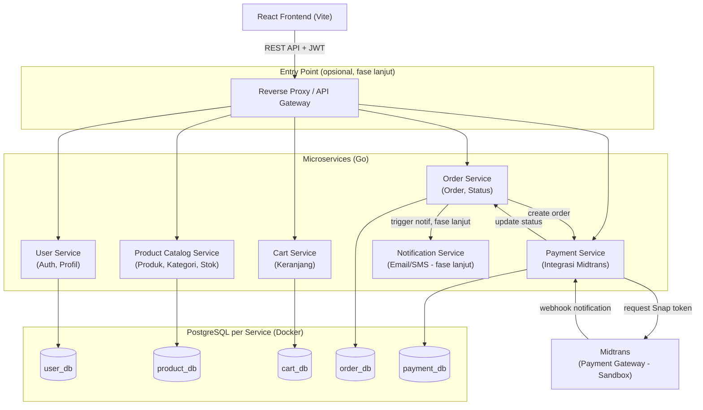

# Architecture Diagram & Monorepo Folder Structure

## 1. Diagram Arsitektur Sistem



**Catatan alur:**
- Semua request dari Client melewati JWT yang diterbitkan oleh **User Service** dan diverifikasi oleh service lain.
- **API Gateway** bersifat opsional di awal — bisa langsung expose tiap service lewat port berbeda selama development, baru ditambahkan reverse proxy saat mendekati deployment.
- Tiap service punya database PostgreSQL sendiri (database-per-service), dijalankan sebagai container terpisah lewat Docker Compose.
- Payment Service adalah satu-satunya service yang berkomunikasi langsung dengan Midtrans (request Snap token & menerima webhook).

---

## 2. Struktur Folder Monorepo

```
ecommerce-platform/
├── apps/
│   └── web/                        # Frontend React (Vite)
│       ├── src/
│       │   ├── components/
│       │   ├── pages/
│       │   ├── context/             # Auth context, dsb
│       │   ├── hooks/
│       │   ├── services/            # axios/fetch wrapper ke tiap microservice
│       │   ├── store/                # Zustand store (jika dipakai)
│       │   ├── routes/
│       │   └── App.tsx
│       ├── index.html
│       ├── package.json
│       └── vite.config.ts
│
├── services/
│   ├── user-service/
│   │   ├── cmd/
│   │   │   └── main.go
│   │   ├── internal/
│   │   │   ├── handler/
│   │   │   ├── service/
│   │   │   ├── repository/
│   │   │   └── model/
│   │   ├── migrations/
│   │   ├── Dockerfile
│   │   └── go.mod
│   │
│   ├── product-service/
│   │   ├── cmd/main.go
│   │   ├── internal/{handler,service,repository,model}/
│   │   ├── migrations/
│   │   ├── Dockerfile
│   │   └── go.mod
│   │
│   ├── cart-service/
│   │   ├── cmd/main.go
│   │   ├── internal/{handler,service,repository,model}/
│   │   ├── Dockerfile
│   │   └── go.mod
│   │
│   ├── order-service/
│   │   ├── cmd/main.go
│   │   ├── internal/{handler,service,repository,model}/
│   │   ├── migrations/
│   │   ├── Dockerfile
│   │   └── go.mod
│   │
│   ├── payment-service/
│   │   ├── cmd/main.go
│   │   ├── internal/
│   │   │   ├── handler/
│   │   │   ├── service/
│   │   │   ├── repository/
│   │   │   ├── model/
│   │   │   └── midtrans/            # wrapper client Midtrans
│   │   ├── migrations/
│   │   ├── Dockerfile
│   │   └── go.mod
│   │
│   └── notification-service/        # fase lanjut
│       ├── cmd/main.go
│       ├── internal/{handler,service}/
│       ├── Dockerfile
│       └── go.mod
│
├── docker-compose.yml               # orkestrasi semua service + database
├── .env.example
├── docs/
│   ├── 01-project-requirements.md
│   └── 02-architecture-and-folder-structure.md
└── README.md
```

**Prinsip struktur:**
- Setiap service Go punya `go.mod` sendiri (independent module), bukan satu `go.mod` besar — supaya benar-benar independen sesuai prinsip microservices.
- Folder `internal/` di tiap service mengikuti pola `handler → service → repository → model` yang konsisten di semua service, sehingga begitu paham satu service, service lain lebih mudah diikuti.
- `docker-compose.yml` di root menjadi satu titik untuk menjalankan seluruh sistem (`docker compose up`) saat development.
- Frontend berada di `apps/web` — dipisah jelas dari `services/` agar monorepo tetap terorganisir walau nanti bertambah service lain.
